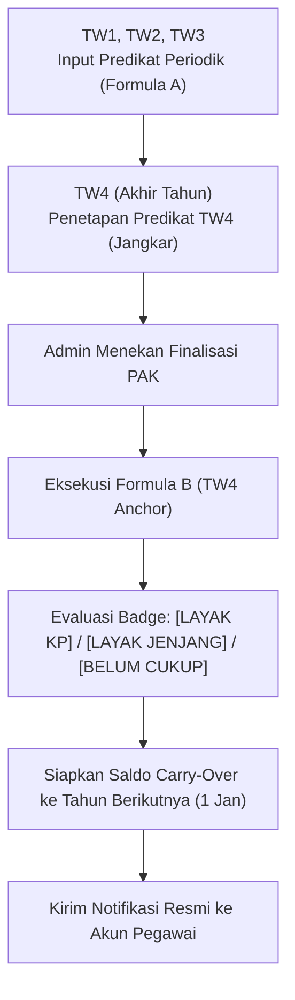

# 🏛️ Backend Engine Konversi Angka Kredit Kinerja Pegawai KPK

Sistem Backend berbasis **Laravel 12 / PHP 8.3** untuk manajemen, kalkulasi, evaluasi kelayakan kenaikan pangkat/jenjang, dan konversi Angka Kredit (AK) kinerja Jabatan Fungsional secara massal sesuai dengan **Peraturan BKN Nomor 3 Tahun 2023** dan **PermenPANRB Nomor 1 Tahun 2023**.

---

## 📑 Daftar Isi
1. [Dasar Regulasi & Konsep Utama](#-dasar-regulasi--konsep-utama)
2. [Algoritma & Formula Perhitungan](#-algoritma--formula-perhitungan)
3. [Sistem Badge & Logika Kelayakan (Badging Engine)](#-sistem-badge--logika-kelayakan-badging-engine)
4. [Alur Kerja Sistem (Workflows)](#-alur-kerja-sistem-workflows)
5. [Fitur-Fitur Utama Backend](#-fitur-fitur-utama-backend)
6. [Katalog Endpoint REST API](#-katalog-endpoint-rest-api)
7. [Studi Kasus UAT: Sdr. Budi (2 Tahun Berjalan)](#-studi-kasus-uat-sdr-budi-2-tahun-berjalan)
8. [Panduan Instalasi & Menjalankan](#-panduan-instalasi--menjalankan)

---

## 📜 Dasar Regulasi & Konsep Utama

Sistem ini mengimplementasikan aturan kepegawaian ASN/KPK:
*   **Koefisien Tahunan Jabatan Fungsional Keahlian**:
    *   **Ahli Pertama**: `12.5` AK/tahun (Target KP: `50 AK`, Target Jenjang: `100 AK`)
    *   **Ahli Muda**: `25.0` AK/tahun (Target KP: `100 AK`, Target Jenjang: `200 AK`)
    *   **Ahli Madya**: `37.5` AK/tahun (Target KP: `150 AK`, Target Jenjang: `450 AK`)
    *   **Ahli Utama**: `50.0` AK/tahun (Target KP: `200 AK`, Target Jenjang: `9999 AK`)
*   **Persentase Konversi Predikat Kinerja**:
    *   *Sangat Baik*: `150%` (1.50)
    *   *Baik*: `100%` (1.00)
    *   *Butuh Perbaikan*: `75%` (0.75)
    *   *Kurang*: `50%` (0.50)
    *   *Sangat Kurang*: `25%` (0.25)
*   **Angka Kredit Dasar (AK Dasar)**:
    *   Golongan Pintu Masuk Awal (III/a, III/c, IV/a) $\rightarrow$ **`0 AK`** (Wajib mengumpulkan dari 0).
    *   Golongan Lanjutan (III/b $\rightarrow$ **`50 AK`**, III/d $\rightarrow$ **`100 AK`**, IV/b $\rightarrow$ **`150 AK`**, IV/c $\rightarrow$ **`300 AK`**) $\rightarrow$ Mendapat modal dasar otomatis agar tidak dirugikan saat perpindahan jabatan.

---

## 🧮 Algoritma & Formula Perhitungan

### 1. Formula A: Konversi Periodik Triwulanan (Monitoring)
Digunakan untuk mencatat progres kinerja di TW1, TW2, dan TW3:
$$\text{AK}_{\text{Periodik}} = \left( \frac{\text{Bulan Aktif}}{12} \right) \times \text{Persentase Predikat} \times \text{Koefisien Tahunan}$$

### 2. Formula B: Normalisasi Retrospektif Akhir Tahun (TW4 Anchor)
Digunakan pada penutupan buku tahun berjalan. Predikat TW4 bertindak sebagai jangkar (*anchor*) retrospektif untuk menyetahunkan perolehan AK:
$$\text{AK}_{\text{Tahun Berjalan}} = \left( \frac{\text{Total Bulan Aktif}}{12} \right) \times \text{Persentase Predikat TW4} \times \text{Koefisien Tahunan}$$

### 3. Formula C: PAK Pelantikan dari Masa Kerja Jabatan Lama
Mengonversi masa kerja staf pelaksana sebelum diangkat ke Jabatan Fungsional:
$$\text{AK}_{\text{Pelantikan}} = (\text{Tahun} \times \% \times \text{Koef}) + \left( \frac{\text{Bulan}}{12} \times \% \times \text{Koef} \right)$$
*Contoh:* Masa kerja 3 tahun 5 bulan di golongan III/a (Baik 100%, koef 12.5):
$$3 \times 1.0 \times 12.5 = 37.50\text{ AK}$$
$$\frac{5}{12} \times 1.0 \times 12.5 = 5.21\text{ AK}$$
$$\text{Total PAK Pelantikan} = 37.50 + 5.21 = \mathbf{42.71\text{ AK}}$$

### 4. Formula D: Booster Ijazah Baru (+25%)
Tambahan Angka Kredit pengakuan pendidikan baru yang lebih tinggi:
$$\text{AK}_{\text{Booster}} = 25\% \times \text{Kebutuhan AK Kenaikan Pangkat Jenjang Saat Ini}$$
*(Contoh Jenjang Ahli Pertama target KP 50 $\rightarrow$ Bonus Booster = $25\% \times 50 = \mathbf{12.50\text{ AK}}$).*

### 5. Akumulasi Total Saldo AK Akhir Tahun
$$\text{Total AK} = \text{AK Dasar} + \text{PAK Pelantikan} + \text{Saldo Historis} + \text{AK Lama} + \text{AK Baru} + \text{AK Booster}$$

---

## 🏷️ Sistem Badge & Logika Kelayakan (Badging Engine)

Setelah finalisasi akhir tahun, sistem mengevaluasi total AK kumulatif terhadap target:

| Status Internal | Label Badge UI | Warna | Logika Sisa Saldo (*Carry-Over*) |
| :--- | :--- | :---: | :--- |
| `LAYAK_JENJANG` | **`[LAYAK NAIK JENJANG]`** | 🟢 Hijau | **Hangus (Carry-Over = 0)**. Sesuai aturan BKN, promosi jenjang me-reset saldo AK. |
| `LAYAK_PANGKAT` | **`[LAYAK NAIK PANGKAT]`** | 🟢 Hijau | **Ditabung (Carry-Over = Sisa)**. $\text{Carry-Over} = \text{AK Kumulatif} - \text{Target KP}$. |
| `BELUM_CUKUP` | **`[BELUM CUKUP AK]`** | 🟠 Oranye | **Dibawa Utuh (100%)**. Seluruh saldo disimpan menjadi saldo awal tahun depan. |

---

## 🔄 Alur Kerja Sistem (Workflows)

### 1. Workflow Kinerja Tahunan Standar



### 2. Workflow Pengajuan & Booster Ijazah (+25% AK)
1. **Pegawai**: Mengunggah scan Ijazah baru + Surat Pengesahan/Pencantuman Gelar BKN.
2. **Admin**: Memeriksa keabsahan fisik berkas dokumen.
3. **Sistem (Auto-Check 3 Syarat BKN)**:
   - ✅ Pendidikan harus lebih tinggi dari pendidikan terakhir.
   - ✅ Evaluasi kinerja terakhir minimal predikat *Baik* ($\ge 100\%$).
   - ✅ Belum pernah mengklaim bonus untuk jenjang strata yang sama.
4. **Hasil**: Pendidikan terakhir pegawai ter-update (e.g. S1 $\rightarrow$ S2) dan bonus $+25\%$ AK langsung masuk ke saldo kumulatif tahun berjalan.

### 3. Workflow Import Massal Spreadsheet (`.xlsx` & `.csv`)
1. **Admin**: Mengunggah file spreadsheet dari e-Kinerja / SIMPEG KPK.
2. **Sinkronisasi Pegawai (`NIP`)**:
   - Jika NIP baru $\rightarrow$ Buat akun login & profil kepegawaian otomatis.
   - Jika NIP lama $\rightarrow$ Update mutasi data pangkat/pendidikan tanpa menghapus riwayat lama.
3. **Auto-Konversi Instan**:
   - Memproses PAK Pelantikan, evaluasi TW1–TW4, Formula B TW4 Anchor, Booster, dan penetapan status badge dalam satu transaksi database (`DB::transaction`).

---

## ⚡ Fitur-Fitur Utama Backend

*   **Native OpenXML XLSX & CSV Parser**: Membaca file `.xlsx` dan `.csv` secara langsung tanpa library pihak ketiga yang berat.
*   **Dry-Run / Preview Import**: Melihat tabel simulasi dan mengecek baris error sebelum data disimpan ke database.
*   **Idempotent Data Sync**: Aman di-import berulang kali tanpa risiko duplikasi data atau penggelembungan AK.
*   **Role-Based Access Control (Sanctum)**: Pemisahan hak akses antara `ADMIN` dan `PEGAWAI`.
*   **Audit Trail Compliance**: Merekam jejak audit di setiap perubahan data penting (user, modul, aksi, perubahan data sebelum vs sesudah, IP, User-Agent).
*   **Export Laporan Rekapitulasi CSV**: Mengunduh rekapitulasi penetapan AK seluruh pegawai beserta badge kelayakannya.

---

## 🔌 Katalog Endpoint REST API

### Autentikasi
*   `POST /api/login` - Login pengguna (Bearer token).
*   `POST /api/logout` - Logout & revoke token.
*   `GET /api/me` - Profil pengguna login beserta data kepegawaian.

### Master Data Peraturan BKN
*   `GET /api/master-data` - Daftar master acuan Peraturan BKN No. 3 Tahun 2023: jenjang jabatan, predikat kinerja, dan AK dasar.

### Evaluasi Kinerja
*   `GET /api/evaluasi` - Daftar evaluasi kinerja (Admin: semua, Pegawai: milik sendiri).
*   `POST /api/evaluasi` - Simpan evaluasi triwulanan (Formula A).
*   `POST /api/evaluasi/simulasi` - Simulasi preview hitung AK (Periodik / Tahunan Formula B).
*   `POST /api/evaluasi/{id}/lock` - Kunci predikat evaluasi kinerja.

### Pengajuan Pendidikan & Booster Ijazah
*   `GET /api/pengajuan-pendidikan` - Daftar antrean pengajuan ijazah.
*   `POST /api/pengajuan-pendidikan` - Pegawai mengunggah berkas ijazah & bukti BKN.
*   `GET /api/pengajuan-pendidikan/{id}` - Detail berkas pengajuan.
*   `POST /api/pengajuan-pendidikan/{id}/verifikasi` - Admin memverifikasi & mengeksekusi bonus.

### Rekapitulasi PAK & Finalisasi
*   `GET /api/rekapitulasi` - Daftar rekapitulasi PAK & status badge seluruh pegawai.
*   `GET /api/rekapitulasi/ringkasan` - Statistik dashboard per jenjang jabatan.
*   `GET /api/rekapitulasi/export` - Download file CSV rekapitulasi PAK.
*   `GET /api/rekapitulasi/{pegawaiId}/{tahun}` - Detail PAK satu pegawai & rincian TW1–TW4.
*   `POST /api/rekapitulasi/{pegawaiId}/{tahun}/finalisasi` - Eksekusi Formula B & penetapan carry-over.
*   `POST /api/rekapitulasi/{pegawaiId}/pak-pelantikan` - Input manual PAK Pelantikan dari masa kerja.
*   `POST /api/rekapitulasi/{pegawaiId}/saldo-historis` - Input manual saldo bawaan kepegawaian.

### Import Spreadsheet Massal
*   `GET /api/import/template` - Unduh template resmi CSV import konversi kinerja.
*   `POST /api/import/preview` - Dry-run / preview kalkulasi sebelum disimpan.
*   `POST /api/import/proses` - Eksekusi import massal & auto-konversi ke database.

### Manajemen Pegawai & Notifikasi
*   `GET, POST, PUT, DELETE /api/pegawai` - CRUD data pegawai & auto-generate akun user.
*   `GET /api/notifikasi` - Daftar notifikasi pengguna login.
*   `PATCH /api/notifikasi/{id}/baca` - Tandai notifikasi telah dibaca.
*   `POST /api/notifikasi/baca-semua` - Tandai semua notifikasi telah dibaca.

---

## 🧪 Studi Kasus UAT: Sdr. Budi (2 Tahun Berjalan)

Berikut adalah hasil replikasi matematis studi kasus resmi UAT KPK (`simulasi_konversi_ak_kpk-v6.xlsx`):

### Tahun 1 (2025) – Golongan III/a (TMT Maret 2025, Klaim Ijazah S1)
*   **PAK Pelantikan (3 Thn 5 Bln)**: `42.71 AK`
*   **Saldo Historis**: `10.00 AK`
*   **Kinerja Triwulanan**: TW1–TW3 *Sangat Baik*, TW4 *Baik (Jangkar)* $\rightarrow$ Aktif 10 bulan.
*   **AK Baru Tahunan (Formula B)**: $\frac{10}{12} \times 1.0 \times 12.5 = \mathbf{10.42\text{ AK}}$
*   **Booster Ijazah S1**: $25\% \times 50 = \mathbf{12.50\text{ AK}}$
*   **Total AK Kumulatif**: $10.00 + 42.71 + 10.42 + 12.50 = \mathbf{75.63\text{ AK}}$
*   **Keputusan**: **`[LAYAK NAIK PANGKAT]`** $\rightarrow$ Naik ke **Golongan III/b**.
*   **Deposit Carry-Over ke Tahun 2**: $75.63 - 50.00 = \mathbf{25.63\text{ AK}}$.

### Tahun 2 (2026) – Golongan Baru III/b (Aktif 12 Bulan Penuh)
*   **Saldo Awal (Carry-Over)**: `25.63 AK`
*   **Kinerja Triwulanan**: TW1–TW3 *Baik*, TW4 *Sangat Baik (Jangkar)* $\rightarrow$ Aktif 12 bulan.
*   **AK Baru Tahunan (Formula B)**: $\frac{12}{12} \times 1.5 \times 12.5 = \mathbf{18.75\text{ AK}}$
*   **Total AK Kumulatif**: $25.63 + 18.75 = \mathbf{44.38\text{ AK}}$
*   **Keputusan**: **`[BELUM CUKUP AK]`** (Target KP III/b $\rightarrow$ III/c butuh 50 AK, kurang `5.62 AK`).
*   **Deposit Carry-Over ke Tahun 3**: **`44.38 AK`** (Dibawa utuh ke tahun berikutnya).

---

## 🚀 Panduan Instalasi & Menjalankan

### 1. Prasyarat Sistem
*   PHP $\ge$ 8.3 dengan ekstensi `pdo`, `mbstring`, `zip`, `simplexml`, `openssl`.
*   Composer $\ge$ 2.x

### 2. Setup Awal
```bash
# Pindah ke direktori backend
cd backend

# Salin environment file
cp .env.example .env

# Install dependencies
composer install

# Generate application key
php artisan key:generate

# Jalankan migrasi dan seeder master BKN
php artisan migrate --seed
```

### 3. Akun Default Seeder
*   **Admin Kepegawaian**: `admin@kpk.go.id` / `password123`
*   **Atasan Penilai**: `atasan@kpk.go.id` / `password123`
*   **Pegawai Fungsional**: `pegawai@kpk.go.id` / `password123`

### 4. Menjalankan Server & Unit Test
```bash
# Menjalankan development server
php artisan serve

# Menjalankan seluruh test suite otomatis
php artisan test
```
