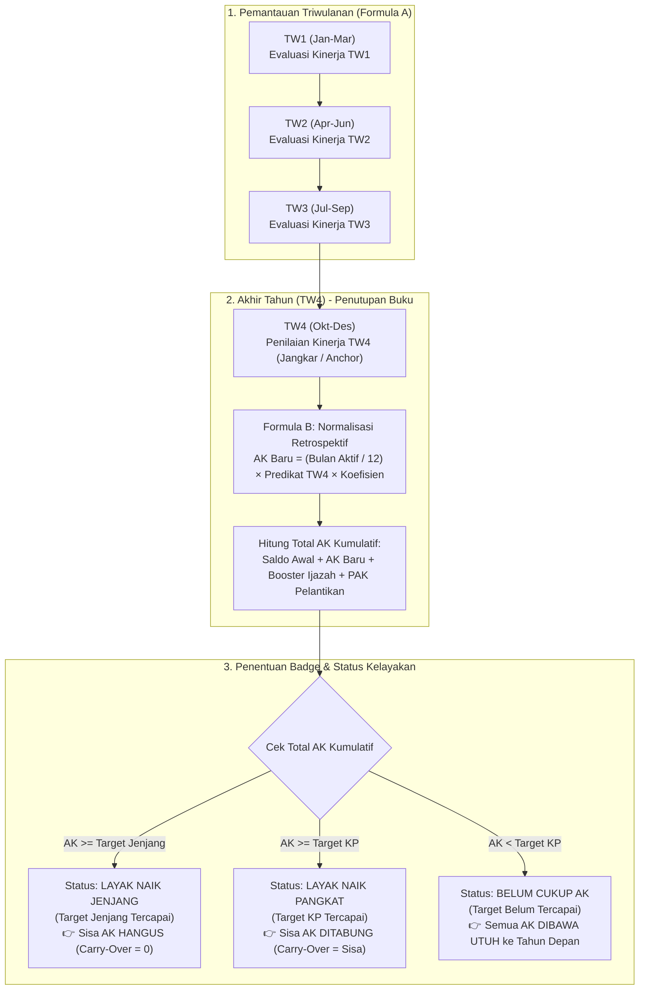

Pemahaman Anda mengenai alur TW4 sebagai **normalisasi akhir tahun** sudah **sangat tepat**. 

Mari kita luruskan detail mekanismenya: **kenaikan pangkat/jenjang** dalam regulasi BKN dan KPK dievaluasi secara definitif di **akhir tahun (TW4)** setelah seluruh perolehan disetahunkan (dinormalisasi). 

Berikut adalah gambaran menyeluruh mulai dari **Alur Normal (Standar)**, **Alur Kenaikan Pangkat**, **Alur Promosi Jenjang**, hingga **Kondisi Khusus (TMT Parsial)**:

---

### 🗺️ Timeline Visual Siklus 1 Tahun Kinerja ASN



---

### 1. Workflow Normal (Siklus Standar Tanpa Naik Pangkat)

Ini adalah alur untuk pegawai yang belum memenuhi target angka kredit:

1. **TW1 – TW3 (Monitoring Periodik)**:
   - Atasan memberikan predikat kinerja per triwulan.
   - Sistem mencatat angka kredit periodik (Formula A) untuk keperluan monitoring dashboard.
2. **TW4 (Jangkar Evaluasi Tahunan)**:
   - Atasan menetapkan predikat kinerja TW4 (misal: *Baik* = 100%).
   - Sistem menjalankan **Formula B (TW4 Anchor)**: seluruh kinerja 12 bulan dihitung rata memakai predikat TW4.
   - $\text{AK Baru} = \frac{12}{12} \times 100\% \times \text{Koefisien}$.
3. **Pengecekan Kelayakan**:
   - Total AK Kumulatif dihitung ($\text{Saldo Awal} + \text{AK Baru}$).
   - Karena belum mencapai target minimal (misal baru 44.38 dari target 50 AK), sistem memberikan label badge: **`[BELUM CUKUP AK]`**.
4. **Lanjut ke Tahun Depan (Carry-Over)**:
   - Seluruh saldo 44.38 AK otomatis dijadikan **Saldo Awal** di tanggal 1 Januari tahun berikutnya.

---

### 2. Workflow Kondisional A: Kenaikan Pangkat (KP) Reguler

Terjadi saat pegawai berhasil mengumpulkan AK melampaui target kenaikan pangkat (misal dari Golongan **III/a ke III/b**, target 50 AK):

```
Contoh Kasus:
Total AK Kumulatif Akhir Tahun = 75.63 AK
Target Naik Pangkat            = 50.00 AK
```

1. **Evaluasi Akhir Tahun**: Total 75.63 $\ge$ 50.00.
2. **Badge & Label**: Muncul badge **`[LAYAK NAIK PANGKAT]`** (Warna Hijau/Success).
3. **Pemotongan Target**: Hak naik pangkat diambil sebesar 50.00 AK.
4. **Deposit Saldo (Carry-Over)**:
   $$\text{Sisa Tabungan} = 75.63 - 50.00 = \mathbf{25.63\text{ AK}}$$
5. **Tahun Baru**: Golongan pegawai resmi naik ke **III/b**, dan saldo awal tahun baru otomatis terkunci sebesar **25.63 AK**.

---

### 3. Workflow Kondisional B: Promosi Naik Jenjang Jabatan (AK Hangus)

Terjadi saat pegawai naik **Jenjang Jabatan Fungsional** (misal dari **Ahli Pertama ke Ahli Muda**, target 100 AK):

```
Contoh Kasus:
Total AK Kumulatif Akhir Tahun = 115.00 AK
Target Naik Jenjang            = 100.00 AK
```

1. **Evaluasi Akhir Tahun**: Total 115.00 $\ge$ 100.00.
2. **Badge & Label**: Muncul badge **`[LAYAK NAIK JENJANG]`** (Warna Hijau/Success).
3. **Aturan BKN (KPK)**: Berbeda dengan kenaikan pangkat, kenaikan jenjang jabatan **me-reset perolehan AK**.
4. **Sisa AK HANGUS**:
   $$\text{Kelebihan } (115.00 - 100.00 = 15.00\text{ AK}) \rightarrow \mathbf{\text{HANGUS (Carry-Over = 0)}}$$
5. **Tahun Baru**: Pegawai menjabat di jenjang baru (**Ahli Muda**) dengan **Saldo Awal = 0 AK** (mulai mengumpulkan target baru jenjang Ahli Muda).

---

### 4. Workflow Kondisional C: Masuk Tengah Tahun (TMT Parsial + PAK Pelantikan)

Seperti pada **Studi Kasus Budi (TMT Pelantikan Maret 2025)**:

1. **Saldo Bawaan & PAK Pelantikan Masuk Manual di Awal**:
   - Saldo Historis Kepegawaian: **`10.00 AK`**
   - PAK Pelantikan (Masa kerja lama 3 thn 5 bln): **`42.71 AK`**
2. **Bulan Aktif Dihitung Proporsional**:
   - Karena TMT Maret, aktif di tahun tersebut hanya **10 bulan** (Maret–Desember).
3. **Di TW4 Normalisasi**:
   - Nilai TW4 (Baik = 100%) menormalisasi 10 bulan aktif:
     $$\text{AK Baru} = \frac{10}{12} \times 1.0 \times 12.5 = \mathbf{10.42\text{ AK}}$$
4. **Klaim Booster Ijazah**:
   - Lolos verifikasi S1 $\rightarrow$ dapat bonus $25\% \times 50 = \mathbf{12.50\text{ AK}}$.
5. **Total Kumulatif**:
   $$10.00 + 42.71 + 10.42 + 12.50 = \mathbf{75.63\text{ AK}} \rightarrow \mathbf{\text{[LAYAK NAIK PANGKAT]}}$$

---

### 📊 Ringkasan Matriks Keputusan Sistem

| Skenario Pegawai | Syarat / Kondisi | Badge / Label | Sisa Saldo ke Tahun Baru |
| :--- | :--- | :--- | :--- |
| **Kinerja Berjalan** | Kumulatif $<$ Target KP | `[BELUM CUKUP AK]` | Dibawa Utuh ($100\%$) |
| **Naik Pangkat (KP)** | Kumulatif $\ge$ Target KP | `[LAYAK NAIK PANGKAT]` | Sisa Selisih ($\text{Kumulatif} - \text{Target}$) |
| **Naik Jenjang (Promosi)** | Kumulatif $\ge$ Target Jenjang | `[LAYAK NAIK JENJANG]` | **0 (Hangus)** |
| **Ada Ijazah Baru** | Lolos Syarat Otomatis | Bonus Booster $+25\%$ | Masuk ke akumulasi tahun berjalan |
